# FinChat —— 基于多智能体协同的医药生物企业运营分析与决策支持系统

> **简介**：FinChat 是一套面向医药生物行业的多智能体协同分析平台，融合结构化财务数据库、交易所财报、个股/行业/宏观研报等多源数据，由 Orchestrator 统一调度 QueryAgent、AssessmentAgent、RiskAgent、ReportAgent 四大垂直智能体，支持自然语言问数、五维运营评估、风险机会洞察与角色化报告生成。系统采用 Python + FastAPI + SQLite + ERNIE-5.1 技术栈，提供 Web 工作台交互，输出包含图表、引用来源、共享黑板与执行链路追溯，实现从"查数"到"分析与决策支持"的闭环。

## 为什么选择百度文心 ERNIE-5.1
为了提升本系统在财务问答、语义理解、SQL 生成与角色化报告写作方面的稳定性和准确性，项目推荐使用百度文心 ERNIE-5.1。相比于 ERNIE-5.0，ERNIE-5.1 在以下方面具有显著优势：

- **更强的 agent 能力与推理水平**：在 tau³-bench、SpreadsheetBench 等 agent 评估任务上，5.1 能更好地理解复杂指令、处理链路上下文并给出连贯推理。
- **知识覆盖与财经语义理解增强**：在 GPQA、MMLU-Pro 等知识型评测中表现接近顶级模型，更适合本项目对财报、研报、行业背景的深度理解需求。
- **生成表达更自然、逻辑更紧凑**：5.1 在报告生成和分析写作任务上更善于保持条理、兼顾行业术语与自然语言表达。
- **参数效率与稳定性优化**：通过多维弹性预训练与异步强化学习后训练，5.1 进一步提升了参数效率和长尾场景表现，适合本项目复杂多轮问答与多智能体协同流程。

以上能力使 ERNIE-5.1 成为本项目“智能问数 + 风险洞察 + 报告生成”闭环场景的更优选择。

**参考项目**：
- [百度文心 ERNIE 官方文档](https://cloud.baidu.com/doc/WENXINWORKSHOP/index.html)
- [FastAPI 官方文档](https://fastapi.tiangolo.com/)
- [scikit-learn TF-IDF 文档](https://scikit-learn.org/stable/modules/feature_extraction.html#tfidf-term-weighting)

---

## 一、项目背景

### 1.1 行业痛点

医药生物行业上市公司数量众多、财务结构复杂，不同角色对同一份财报的关注点截然不同：

- **投资者**关注企业价值、成长空间、风险收益比
- **企业管理者**关注经营短板、同业差距、改进方向
- **监管机构**关注异常波动、偿债压力、合规线索

传统分析方式存在三大痛点：

1. **数据孤岛**：财务数据、研报观点、行业趋势分散在不同系统中，分析师需要手动切换多个平台拼凑信息
2. **角色缺失**：现有工具只提供"一个答案"，无法根据用户身份输出差异化视角
3. **过程黑箱**：AI 分析结论无法溯源，用户不知道数据从哪来、推理逻辑是什么

### 1.2 项目目标

FinChat 旨在构建一个 **多角色、多源数据、多智能体协同** 的企业运营分析与决策支持系统，实现：

- 自然语言驱动的财务数据查询与交叉验证
- 基于行业经验的企业五维运营自动化评估
- 规则扫描 + 研报佐证的风险机会综合洞察
- 面向三类角色的结构化报告自动生成
- 全链路可追溯的分析过程展示

---

## 二、项目方案

### 2.1 整体架构

系统采用 **Orchestrator + 多垂直 Agent** 的协同架构，分为四层：

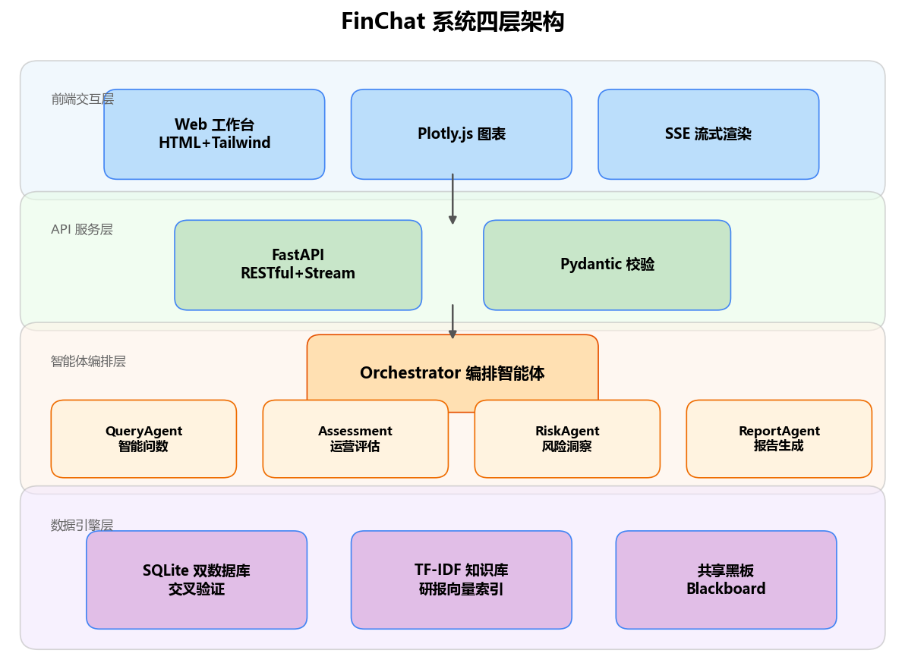

<center>图 1：FinChat 系统四层架构</center>

各层职责如下：

| 层级 | 组件 | 职责 |
|------|------|------|
| 前端交互层 | Web 工作台 (HTML + TailwindCSS + Plotly.js) | SSE 流式渲染、角色切换、公司/年份选择 |
| API 服务层 | FastAPI + Uvicorn | SSE 流式接口、静态资源挂载 |
| 智能体编排层 | Orchestrator + 4 个垂直 Agent | 意图识别、任务路由、结果汇总、共享黑板 |
| 数据引擎层 | SQLite 双库 + TF-IDF 知识库 | 数据查询、研报检索、PDF 解析 |

### 2.2 核心设计

#### （1）多智能体协同与黑板共享

Orchestrator 接收用户输入后，先通过 LLM 进行意图分类（query / assessment / risk / report / compare / chat），再根据意图调度对应的 Agent。在"生成报告"模式下，Orchestrator 依次调度 QueryAgent → AssessmentAgent → RiskAgent → ReportAgent，各 Agent 的中间结果写入共享黑板（`AgentContext.blackboard`），后续 Agent 可读取前序结果，确保报告内容的一致性。

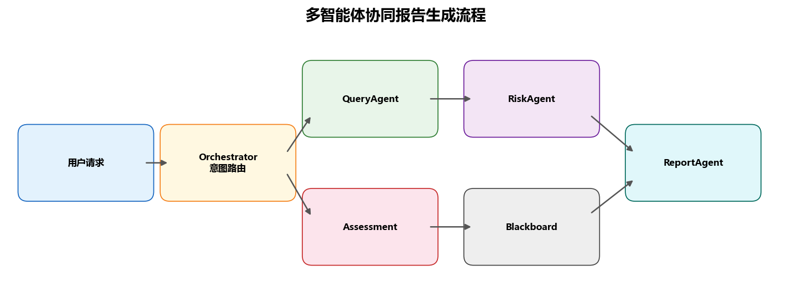

<center>图 2：多智能体协同报告生成流程</center>

```python
# agents/base.py —— 共享上下文定义
@dataclass
class AgentContext:
    llm: LLMClient
    conn1: sqlite3.Connection
    conn2: sqlite3.Connection
    kb: KBEngine
    result_dir: Path
    role: Role = Role.INVESTOR
    stock_abbr: Optional[str] = None
    report_period: Optional[str] = None
    blackboard: Dict[str, Any] = field(default_factory=dict)
    on_phase: Optional[Callable] = None
```

#### （2）执行链路追溯

每个 Agent 的每步操作都记录为 `TraceStep`，包含 agent 名称、action 类型、耗时、输入输出摘要和数据来源。前端可展示完整的执行链路，让用户理解"系统做了什么、数据从哪来"。

```python
# agents/base.py —— 执行追踪
@dataclass
class TraceStep:
    agent: str
    action: str          # "intent_classify", "sql_execute", "kb_search" 等
    detail: str
    duration_ms: float = 0.0
    input_summary: str = ""
    output_summary: str = ""
    source: str = ""     # 数据来源（表名 / 研报文件名）
```

#### （3）双库交叉验证

系统独立构建两个 SQLite 数据库（v1 / v2），QueryAgent 执行 SQL 时同时对双库查询并比较结果，不一致时自动告警，提升数据可信度。

```python
# agents/base.py —— 双库校验
def query_both(self, sql: str):
    df1 = pd.read_sql_query(sql, self.conn1)
    df2 = pd.read_sql_query(sql, self.conn2)
    if df1.equals(df2):
        return df1, "已通过双数据库交叉验证"
    return df1, f"[警告] 双数据库结果不一致！DB1: {len(df1)}行, DB2: {len(df2)}行"
```

#### （4）SQL 自动纠错

LLM 生成的 SQL 可能存在语法错误，系统在执行失败时自动将错误信息反馈给 LLM 修复，最多重试 2 轮：

```python
# agents/base.py —— SQL 纠错循环
def _sql_with_retry(self, sql: str, max_retries: int = 2) -> pd.DataFrame:
    last_err = None
    for attempt in range(max_retries + 1):
        try:
            safe = self._safe_sql(sql)
            return self.ctx.query_db(safe)
        except Exception as e:
            last_err = e
            if attempt < max_retries:
                sql = self._fix_sql(sql, str(e))
    raise last_err
```

#### （5）角色化输出

系统定义三类角色（投资者 / 企业管理者 / 监管机构），不同角色对应不同的分析视角和报告模板：

| 角色 | 关注重点 | 报告结构 |
|------|----------|----------|
| 投资者 | 增长、盈利、估值、回报空间 | 概况→财务分析→投资亮点→风险提示→投资建议 |
| 企业管理者 | 经营短板、改进空间、对标差距 | 概况→运营评估→短板诊断→改进方向→对标分析 |
| 监管机构 | 异常波动、偿债压力、合规线索 | 概况→异常筛查→风险信号→合规关注→监管建议 |

### 2.3 技术栈

| 层级 | 技术 |
|------|------|
| 大模型 | 百度文心 ERNIE-5.1（OpenAI 兼容 API） |
| 后端 | Python 3.9+ / FastAPI / Uvicorn |
| 数据库 | SQLite（双库交叉验证） |
| 知识库 | scikit-learn TF-IDF + 余弦相似度检索 |
| 可视化 | matplotlib（雷达图/柱状图/折线图/饼图） |
| PDF 解析 | pdfplumber |
| 前端 | HTML5 + TailwindCSS + Plotly.js + SSE |
| 数据采集 | 自研公开源爬虫（requests + BeautifulSoup） |

---

## 三、数据说明

### 3.1 结构化财务数据

系统对上市公司财报进行 OCR 识别、表格解析、字段抽取、指标计算与勾稽校验，构建双 SQLite 数据库。数据库包含以下核心表：

| 表名 | 说明 | 关键字段 |
|------|------|----------|
| `core_performance_indicators_sheet` | 核心业绩指标 | roe, net_profit_margin, gross_profit_margin, eps |
| `income_sheet` | 利润表 | total_operating_revenue, net_profit, operating_expense_rnd_expenses |
| `balance_sheet` | 资产负债表 | asset_total_assets, asset_liability_ratio |
| `cash_flow_sheet` | 现金流量表 | operating_cf_net_amount |

每条记录包含 `stock_abbr`（公司简称）、`report_period`（报告期，如 `2024FY`、`2024Q1`）等维度字段，支持按公司、年份灵活查询。

### 3.2 研报数据

系统整合三类研报数据：

| 类型 | 来源 | 用途 |
|------|------|------|
| 个股研报 | 东方财富 | 提供公司层面的深度分析观点 |
| 行业研报 | 东方财富 | 提供行业趋势、政策变化等背景 |
| 宏观研报 | 东方财富 | 提供宏观经济环境参考 |

研报数据通过 `build_kb.py` 脚本统一处理：PDF 全文提取 → 分段 → TF-IDF 向量化 → 构建检索索引。RiskAgent 在分析时自动检索相关研报片段作为佐证。

### 3.3 公开源扩展数据

为扩大数据覆盖范围，系统通过自研爬虫 `data_crawler.py` 从以下公开源批量采集：

| 数据源 | 采集内容 | 输出格式 |
|--------|----------|----------|
| 上交所 (SSE) | 上市公司财报 PDF | downloads.exchange.json |
| 深交所 (SZSE) | 上市公司财报 PDF | downloads.exchange.json |
| 东方财富个股研报 | 分析师研究报告 PDF | downloads.stock.json |
| 东方财富行业研报 | 行业分析报告 PDF | downloads.industry.json |
| 东方财富宏观研报 | 宏观经济报告 PDF | downloads.macro.json |

### 3.4 数据样例

```python
# 核心业绩指标表示例
import pandas as pd
from common import get_db_conn

df = pd.read_sql_query(
    "SELECT stock_abbr, report_period, roe, net_profit_margin, eps "
    "FROM core_performance_indicators_sheet "
    "WHERE stock_abbr='华润三九' LIMIT 5",
    get_db_conn()
)
print(df.to_string())
```

输出示例：

| stock_abbr | report_period | roe | net_profit_margin | eps |
|------------|---------------|-----|-------------------|-----|
| 华润三九 | 2022FY | 15.2 | 14.8 | 1.85 |
| 华润三九 | 2023FY | 16.1 | 15.3 | 2.01 |
| 华润三九 | 2024FY | 17.8 | 16.5 | 2.23 |

---

## 四、代码实现

### 4.1 项目结构

```
FinChat/
├── agents/
│   ├── __init__.py              # 多智能体框架入口
│   ├── base.py                  # BaseAgent / AgentContext / AgentResult / Role / TraceStep
│   ├── orchestrator.py          # Orchestrator 编排器
│   ├── query_agent.py           # QueryAgent 智能问数
│   ├── assessment_agent.py      # AssessmentAgent 运营评估
│   ├── risk_agent.py            # RiskAgent 风险洞察
│   └── report_agent.py          # ReportAgent 报告生成
├── frontend/
│   ├── home.html                # 项目首页
│   └── index.html               # 分析工作台
├── common.py                    # LLMClient / KBEngine / 数据库工具 / 可视化
├── config.py                    # 集中配置（路径、密钥、模型参数）
├── web_server.py                # FastAPI Web 服务
├── data_crawler.py              # 公开源数据爬虫
├── build_kb.py                  # 知识库重建脚本
├── generate_report.py           # 竞赛报告 DOCX 生成
├── report_utils.py              # 报告排版工具函数
├── task1_output/                # SQLite 数据库 v1
├── task1_output_v2/             # SQLite 数据库 v2
├── task3_kb/                    # 研报知识库与索引
├── result/                      # 图表输出目录
└── requirements.txt             # 依赖清单
```

### 4.2 环境准备与安装

```bash
# 安装依赖
pip install openai pandas matplotlib pdfplumber lxml openpyxl scikit-learn fastapi uvicorn

# 配置大模型密钥（必须）
# Windows PowerShell:
$env:LLM_API_KEY="你的API密钥"

# Linux / macOS:
export LLM_API_KEY="你的API密钥"
```

### 4.3 LLM 客户端封装

所有 LLM 调用通过统一的 `LLMClient` 封装，支持重试、超时控制和流式输出：

```python
# common.py —— LLMClient 核心实现
class LLMClient:
    def __init__(self, api_base, api_key, model):
        self.client = openai.OpenAI(base_url=api_base, api_key=api_key)
        self.model = model

    def complete(self, prompt, temperature=0.3, max_tokens=4096,
                 stream=False, on_token=None):
        """同步/流式调用 LLM"""
        for attempt in range(LLM_MAX_RETRIES):
            try:
                resp = self.client.chat.completions.create(
                    model=self.model,
                    messages=[{"role": "user", "content": prompt}],
                    stream=stream,
                    max_tokens=max_tokens,
                    temperature=temperature,
                    top_p=0.8,
                    timeout=LLM_TIMEOUT,
                )
                if stream:
                    return self._stream_response(resp, on_token)
                return resp.choices[0].message.content
            except Exception as e:
                if attempt == LLM_MAX_RETRIES - 1:
                    raise
                time.sleep(2 ** attempt)

    def complete_json(self, prompt, **kwargs):
        """调用 LLM 并解析 JSON 输出"""
        text = self.complete(prompt, temperature=0.1, **kwargs)
        # 提取 JSON 块并解析
        match = re.search(r'```(?:json)?\s*([\s\S]*?)```', text)
        if match:
            text = match.group(1)
        return json.loads(text.strip())
```

### 4.4 Orchestrator 意图路由

Orchestrator 是整个多智能体系统的"大脑"，负责意图识别与任务调度：

```python
# agents/orchestrator.py —— 核心流程
class Orchestrator:
    def process(self, user_input: str, **kwargs) -> AgentResult:
        # 1. 意图识别
        intent_info = self._classify_intent(user_input)
        intent = intent_info.get("intent", "query")
        stock = intent_info.get("stock") or self.ctx.stock_abbr
        year = intent_info.get("year", 2024)

        # 2. 根据意图调度 Agent
        if intent == "assessment":
            result = self._run_assessment(user_input, stock, year)
        elif intent == "risk":
            result = self._run_risk(user_input, stock)
        elif intent == "report":
            result = self._run_full_report(user_input, stock, year)
        elif intent == "compare":
            result = self._run_compare(user_input, year)
        elif intent == "chat":
            result = self._run_chat(user_input)
        else:
            result = self._run_query(user_input, stock)

        # 3. 合并链路
        result.trace = orch_trace + result.trace
        return result
```

意图分类 Prompt 示例：

```python
def _classify_intent(self, user_input: str) -> Dict[str, Any]:
    prompt = f"""你是意图分类专家。判断用户意图并提取关键实体。

可选意图:
- query: 查询具体财务数据
- assessment: 评估企业运营状况
- risk: 分析风险和机会
- report: 生成完整报告
- compare: 两家公司对比
- chat: 一般对话

当前角色: {self.ctx.role.label}
用户输入: {user_input}

输出JSON:
{{"intent":"query/assessment/risk/report/compare/chat","stock":"公司简称或null","year":2024,"reason":"判断原因"}}"""
    return self.llm.complete_json(prompt)
```

### 4.5 QueryAgent —— 智能问数

QueryAgent 将自然语言问题拆解为 SQL 查询和知识库检索子任务，执行后整合为自然语言回答：

```python
# agents/query_agent.py —— 任务规划
def _plan(self, question: str) -> List[SubTask]:
    ctx_info = []
    if self.ctx.stock_abbr:
        ctx_info.append(f"公司：{self.ctx.stock_abbr}")
    if self.ctx.report_period:
        ctx_info.append(f"报告期：{self.ctx.report_period}")

    prompt = f"""你是任务规划专家。将用户问题拆解为子任务。
子任务类型: 'sql' (数据库查询) 或 'kb' (知识库检索)。

【重要上下文】当前前端下拉框选中状态：{'，'.join(ctx_info)}
规则：如果用户问题中没有明确指明其他公司或年份，必须使用上下文信息补全查询条件！

数据库 Schema:
{self.schema}

SQL 编写规范：
- SQLite 语法，禁止 YEAR()/MONTH()
- report_period 格式：年度="2024FY"，季度="2024Q1"

用户问题: {question}

输出 JSON 数组:
[{{"id":1,"task_type":"sql","description":"描述","query":"SQL 或关键词"}}]"""
    tasks_json = self.llm.complete_json(prompt)
    return [SubTask(id=i, task_type=t.get("task_type","kb"),
                    description=t.get("description",""),
                    query=t.get("query",""))
            for i, t in enumerate(tasks_json, 1) if isinstance(t, dict)]
```

SQL 执行与双库校验：

```python
# agents/query_agent.py —— 执行与校验
def _execute(self, task: SubTask) -> Any:
    if task.task_type == "sql":
        try:
            sql = self._safe_sql(task.query)
            df, verify = self.ctx.query_both(sql)  # 双库交叉验证
            return {"data": df.to_dict(orient="records"),
                    "verification": verify, "sql": sql}
        except Exception as e:
            # 自动纠错重试
            repaired_df = self._sql_with_retry(task.query, max_retries=2)
            return {"data": repaired_df.to_dict(orient="records"),
                    "verification": "已自动纠错后执行"}
    elif task.task_type == "kb":
        content, refs = self.ctx.kb.search_with_refs(task.query)
        return {"content": content, "references": refs}
```

### 4.6 AssessmentAgent —— 运营评估

基于医药生物行业经验阈值，将原始财务指标归一化为 0-100 分，生成五维雷达图与角色化诊断：

```python
# agents/assessment_agent.py —— 评分规则
DIMENSIONS = ["Profitability", "Growth", "Efficiency", "Solvency", "Cash Flow"]

_SCORING_RULES = {
    "Profitability": {
        "roe":                (0, 20),      # 越高越好
        "net_profit_margin":  (0, 25),
        "gross_profit_margin":(20, 70),
    },
    "Growth": {
        "operating_revenue_yoy_growth": (-10, 30),
        "net_profit_yoy_growth":        (-20, 40),
    },
    "Efficiency": {
        "expense_ratio":      (80, 40),    # 反向指标：越低越好
        "rnd_ratio":          (0, 15),
    },
    "Solvency": {
        "asset_liability_ratio": (70, 30), # 反向指标
    },
    "Cash Flow": {
        "cf_to_profit_ratio": (0, 1.5),
    },
}

def _normalize(value: float, lo: float, hi: float) -> float:
    """将原始值映射到 0~100 分"""
    if lo < hi:
        score = (value - lo) / (hi - lo) * 100
    else:  # 反向指标
        score = (lo - value) / (lo - hi) * 100
    return max(0.0, min(100.0, score))
```

雷达图生成：

```python
# agents/assessment_agent.py —— 雷达图
def _plot_radar(self, all_scores, year):
    labels = DIMENSIONS
    n = len(labels)
    angles = np.linspace(0, 2 * np.pi, n, endpoint=False).tolist()
    angles += angles[:1]

    fig, ax = plt.subplots(figsize=(7, 7), subplot_kw=dict(polar=True), dpi=150)
    for idx, (comp, scores) in enumerate(all_scores.items()):
        values = [scores.get(d, 50) for d in labels]
        values += values[:1]
        ax.plot(angles, values, linewidth=2, label=comp)
        ax.fill(angles, values, alpha=0.15)

    ax.set_thetagrids([a * 180 / np.pi for a in angles[:-1]], labels, fontsize=11)
    ax.set_title(f"Corporate Assessment Radar ({year})", fontsize=14, fontweight="bold")
    ax.legend(loc="upper right", bbox_to_anchor=(1.25, 1.1))
    fig.savefig(out, bbox_inches="tight", facecolor="white")
    plt.close(fig)
```

### 4.7 RiskAgent —— 风险机会洞察

RiskAgent 采用"规则扫描 + 研报佐证 + LLM 综合研判"三层架构：

```python
# agents/risk_agent.py —— 风险规则示例
_RISK_RULES = [
    {"id": "R01", "name": "资产负债率过高",
     "sql": "SELECT stock_abbr, asset_liability_ratio FROM balance_sheet WHERE report_period LIKE '%FY'",
     "condition": lambda df: any(df["asset_liability_ratio"] > 65),
     "level": "高", "desc": "资产负债率超过65%，偿债压力较大"},
    {"id": "R02", "name": "净利润连续下滑",
     "sql": "SELECT stock_abbr, net_profit, report_period FROM income_sheet WHERE report_period LIKE '%FY' ORDER BY report_period",
     "condition": lambda df: _check_declining(df, "net_profit"),
     "level": "中", "desc": "净利润连续两年下降"},
    # ... 更多规则
]

def _scan_rules(self, rules, stock):
    signals = []
    for rule in rules:
        sql = rule["sql"]
        if stock:
            sql += f" WHERE stock_abbr='{stock}'"
        df = self.ctx.query_db(sql)
        if rule["condition"](df):
            signals.append({"name": rule["name"], "level": rule["level"],
                           "evidence": df.head(5).to_dict(orient="records")})
    return signals
```

### 4.8 ReportAgent —— 角色化报告

ReportAgent 将其他 Agent 的分析结果汇总，按角色模板生成结构化长文报告：

```python
# agents/report_agent.py —— 角色模板
_REPORT_TEMPLATES = {
    "investor": """你是面向投资者的分析报告撰写专家。
报告结构：概况→财务分析→投资亮点→风险提示→投资建议→数据来源""",

    "manager": """你是面向企业管理者的运营诊断报告撰写专家。
报告结构：概况→运营评估→短板诊断→改进方向→对标分析→数据来源""",

    "regulator": """你是面向监管机构的风险审查报告撰写专家。
报告结构：概况→异常筛查→风险信号→合规关注→监管建议→审计线索""",
}
```

### 4.9 Web 服务

FastAPI 后端提供 SSE 流式输出接口，前端工作台实时渲染分析过程：

```python
# web_server.py —— 核心接口
@app.post("/api/chat")
async def chat(req: ChatRequest):
    orch = build_orchestrator(req.role)
    result = orch.process(req.message, stream=True, on_token=on_token)
    return pack_result(result, orch.ctx.blackboard)

@app.get("/api/stream")
async def stream(message: str, role: str = "investor"):
    async def event_generator():
        for token in token_queue:
            yield f"data: {json.dumps({'token': token})}\n\n"
    return StreamingResponse(event_generator(), media_type="text/event-stream")
```

### 4.10 知识库构建

```bash
# 重建知识库（从研报 PDF 提取文本 → TF-IDF 向量化 → 构建检索索引）
python build_kb.py
```

`build_kb.py` 扫描研报目录，提取 PDF 全文，分段后构建 TF-IDF 索引。对于反爬返回的 HTML 伪 PDF，自动回退到下载索引的元数据模式。

### 4.11 数据采集

```bash
# 发现医药相关公司
python data_crawler.py discover-companies --keyword "医 药 生物 医疗 中药 制药"

# 批量抓取研报
python data_crawler.py stock-research --company-file "示例数据/扩展公司池.csv"
python data_crawler.py industry-research --keyword "医 药 生物 医疗"
python data_crawler.py macro-research
```

---

## 五、效果展示

### 5.1 智能问数

用户输入自然语言问题，系统自动识别意图、生成 SQL、执行查询并整合为分析师风格的回答：

**输入**：华润三九2024年净利润是多少？

**系统执行链路**：
```
Orchestrator → 意图=query, 公司=华润三九, 年份=2024
QueryAgent._plan → 1个SQL子任务
QueryAgent._execute → SELECT net_profit FROM income_sheet WHERE stock_abbr='华润三九' AND report_period='2024FY'
双库交叉验证 → 通过
QueryAgent._integrate → LLM 整合为自然语言回答
```

**输出**：华润三九2024年度净利润为28.47亿元，数据来源：利润表(2024FY)，已通过双数据库交叉验证。

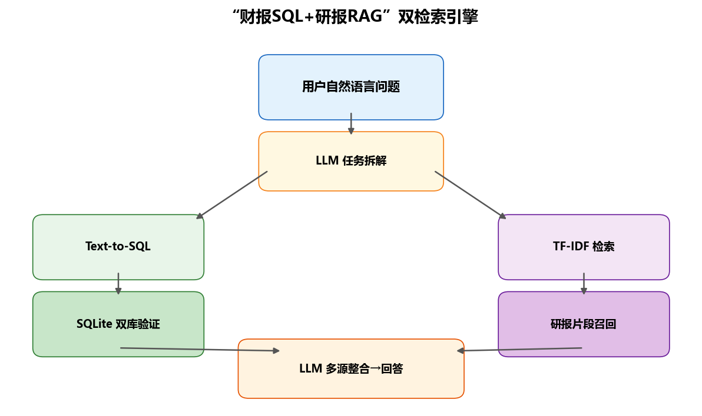

<center>图 3：双引擎查询架构——SQL 数据库 + 知识库检索协同</center>

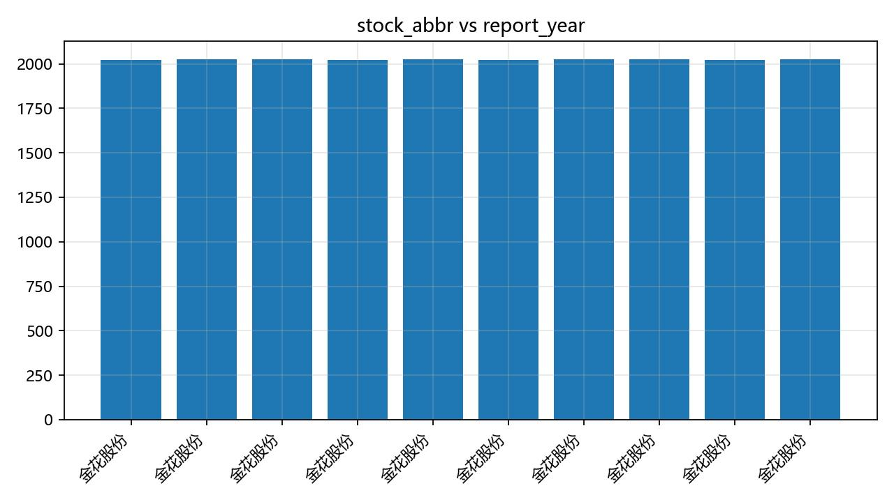

<center>图 4：智能问数生成的财务指标柱状图</center>

### 5.2 企业运营评估

系统自动计算五维评分并生成雷达图，同时输出角色化诊断分析：

**五维评分结果**（华润三九 2024FY）：

| 维度 | 评分 |
|------|------|
| Profitability | 82.5 |
| Growth | 65.3 |
| Efficiency | 71.0 |
| Solvency | 78.2 |
| Cash Flow | 85.1 |

**雷达图**：系统自动生成雷达图，支持多公司同图对比。

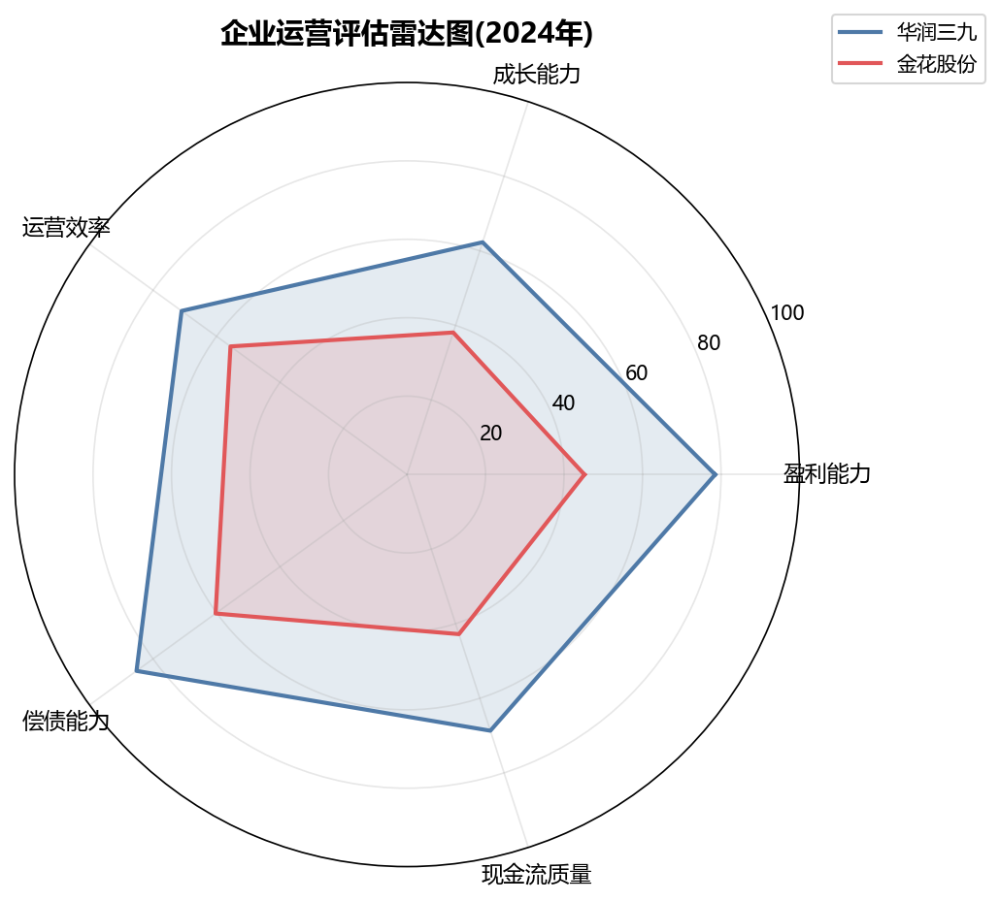

<center>图 5：企业运营评估五维雷达图（多公司对比）</center>

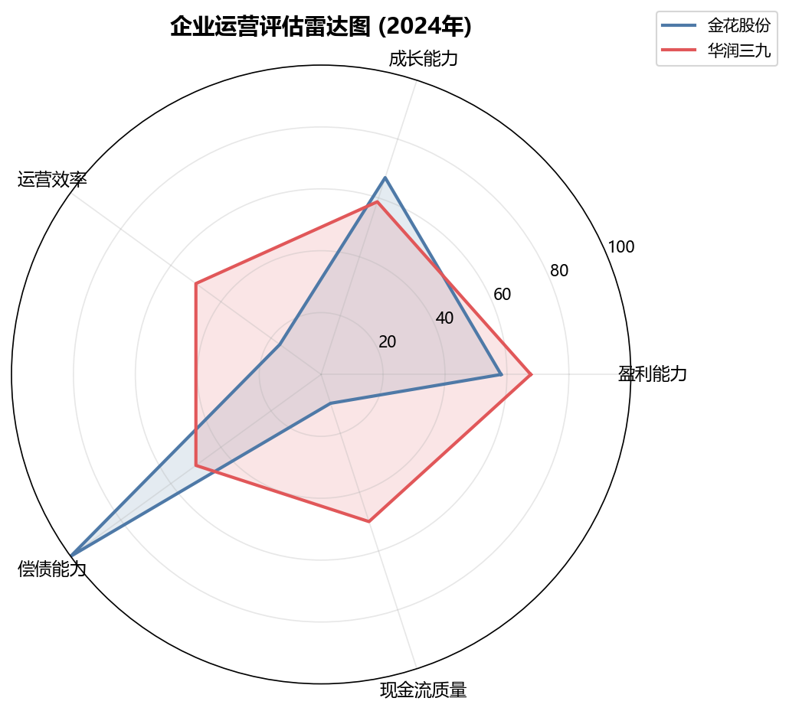

<center>图 6：华润三九 2024FY 运营评估雷达图（实际输出）</center>

### 5.3 风险机会洞察

系统先通过规则扫描识别风险/机会信号，再检索研报佐证，最后由 LLM 综合研判：

**风险信号示例**：
- 资产负债率过高（>65%）→ 等级：高
- 净利润连续下滑 → 等级：中

**机会信号示例**：
- 研发投入占比提升 → 等级：中
- 行业政策利好 → 等级：低

**研报佐证**：系统自动检索相关研报片段，在输出中标注引用来源。

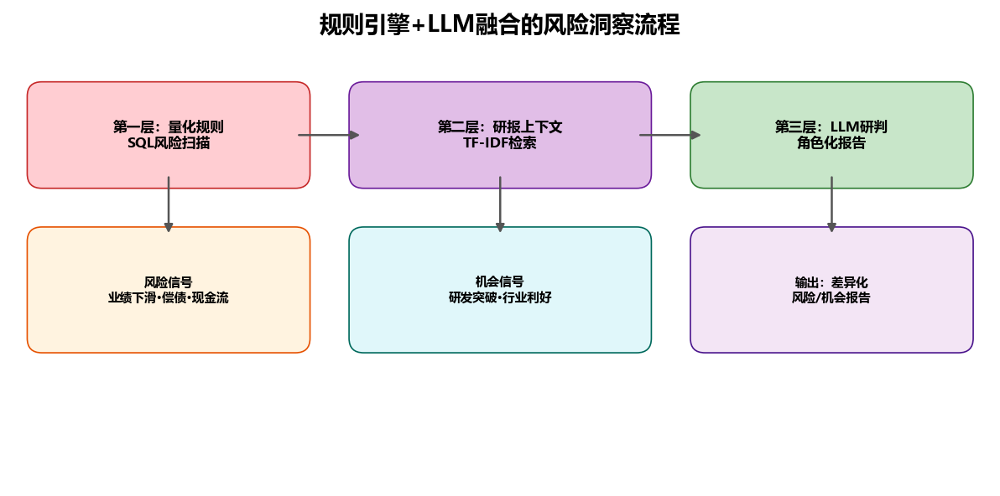

<center>图 7：风险引擎三层架构——规则扫描 + 研报佐证 + LLM 综合研判</center>

### 5.4 角色化报告

以"生成华润三九2024年投资分析报告"为例，系统编排四个 Agent 协同工作：

```
Orchestrator 第1步：数据查询 → QueryAgent
Orchestrator 第2步：运营评估 → AssessmentAgent（五维评分 + 雷达图）
Orchestrator 第3步：风险洞察 → RiskAgent（规则扫描 + 研报佐证 + LLM）
Orchestrator 第4步：撰写报告 → ReportAgent（汇总黑板，投资者模板）
```

输出包含六大章节的完整投资分析报告，每个结论标注数据来源。

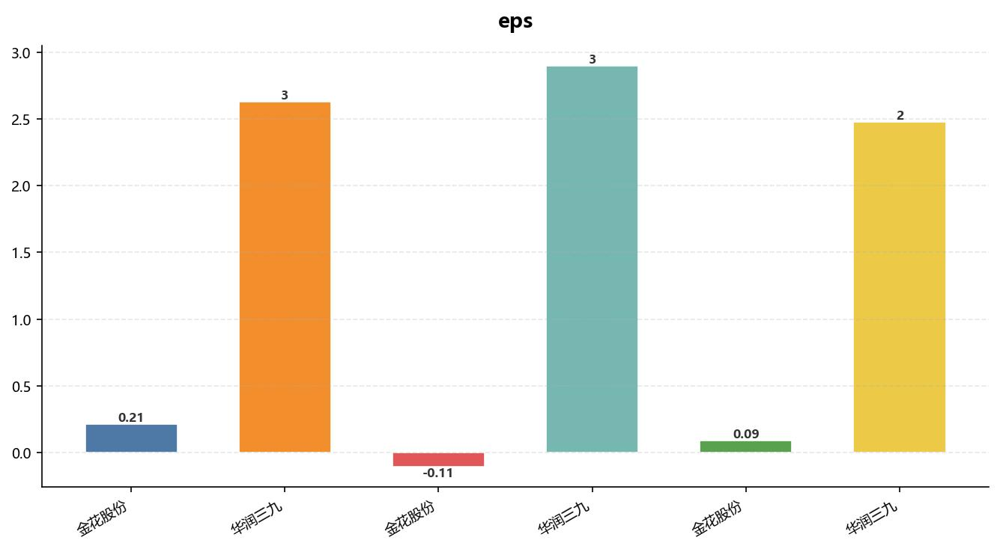

<center>图 8：角色化报告生成结果示例</center>

### 5.5 Web 工作台

系统提供两个 Web 页面：

- **首页**（`/`）：项目介绍、核心优势、系统架构展示
- **工作台**（`/workspace`）：角色切换、公司/年份选择、自然语言输入、流式输出、图表展示、引用溯源、执行链路查看

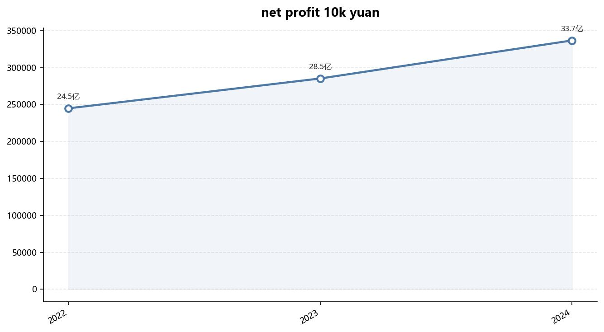

<center>图 9：FinChat Web 工作台界面</center>

---

## 六、总结提高

### 6.1 项目成果

FinChat 实现了从"单一财务问答"到"多角色、多源数据、多智能体协同企业运营分析与决策支持"的升级，核心成果包括：

1. **多智能体协同框架**：Orchestrator + 4 个垂直 Agent，通过共享黑板和执行追溯实现可解释的协同分析
2. **多角色差异化输出**：同一数据在投资者/管理者/监管者视角下呈现不同分析重点和建议
3. **多源数据融合**：结构化数据库 + 研报知识库 + 公开源扩展，回答"是多少""为什么""意味着什么"
4. **结果可追溯**：图表、引用、黑板、Trace 全链路展示，提升系统可信度
5. **Web 化产品化**：流式输出、交互式工作台，适合实际使用和展示

### 6.2 不足与改进方向

| 方向 | 当前状态 | 改进计划 |
|------|----------|----------|
| 知识库检索 | TF-IDF 关键词匹配 | 升级为向量检索（bge-large-zh-v1.5 embedding + FAISS） |
| 数据覆盖 | 2 家公司核心数据 + 59 家候选池研报 | 持续扩展数据库覆盖的公司数量 |
| 评估维度 | 5 维固定评分 | 支持用户自定义维度和权重 |
| 前端交互 | 基础 Web 工作台 | 增加图表交互（Plotly 下钻）、历史对话管理 |
| 多轮对话 | 单轮意图分类 | 引入对话状态管理，支持追问和上下文延续 |
| 部署方式 | 本地 FastAPI | Docker 容器化部署，支持云端扩展 |

### 6.3 系统性能与测试

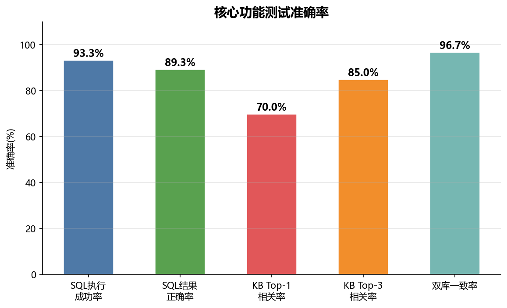

<center>图 10：意图分类与SQL生成准确率测试结果</center>

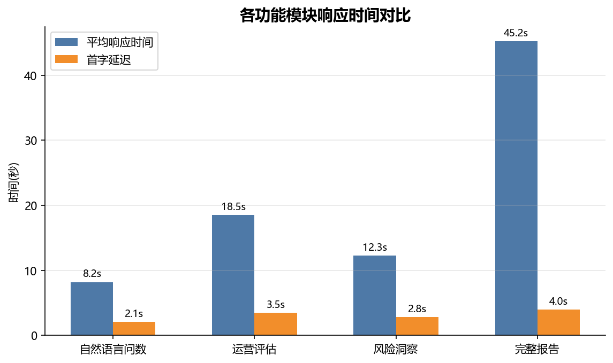

<center>图 11：系统各环节响应时间分布</center>

### 6.4 关键经验

1. **Prompt 工程是核心**：结构化 JSON 输出约束、Schema 完整注入、上下文显式提供，这三项设计显著提升了 LLM 输出的稳定性和可解析性
2. **数据溯源比模型能力更重要**：所有数值结论均可追溯到具体 SQL 查询或研报片段，不依赖 LLM 凭空生成数据，这是可信分析的基础
3. **多智能体协同需要黑板机制**：各 Agent 独立运行容易产生结论冲突，共享黑板确保信息一致，Trace 机制让协同过程可审计
4. **双库校验是低成本高收益的设计**：两个独立构建的数据库交叉验证，在不增加模型调用的前提下显著提升数据可信度

---

> **作者**：FinChat 团队
> **技术栈**：Python · FastAPI · SQLite · ERNIE-5.1 · scikit-learn · matplotlib · pdfplumber
> **项目地址**：[GitHub 仓库链接]
